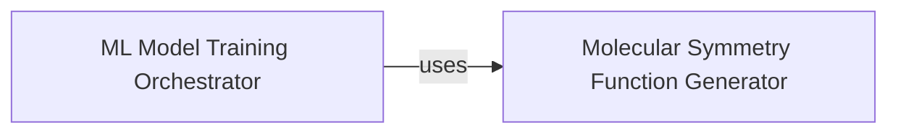

## Details

Advanced Molecular Modeling subsystem

### Molecular Symmetry Function Generator

This component is responsible for the creation of molecular symmetry functions. These functions are crucial for representing molecular environments in a rotationally and translationally invariant manner, serving as robust features for machine learning models in computational chemistry. It encapsulates the algorithms and logic required to transform raw molecular structural data into a numerical feature vector suitable for machine learning.

**Related Classes/Methods**:

- <a href="https://github.com/pfizer-opensource/torsional-strain/blob/master/torsion/model/symmetry_function.py#L1-L1" target="_blank" rel="noopener noreferrer">`torsion/model/symmetry_function.py` (1:1)</a>

### ML Model Training Orchestrator

This component manages the entire workflow for training machine learning models within the `torsion` project, specifically for tasks related to molecular properties such as torsional strain. It orchestrates the collection and preparation of input data (including features generated by the `Molecular Symmetry Function Generator`), handles the definition and configuration of the machine learning model architecture, and executes the training process, including optimization and evaluation.

**Related Classes/Methods**:

- <a href="https://github.com/pfizer-opensource/torsional-strain/blob/master/torsion/model/train.py#L1-L1" target="_blank" rel="noopener noreferrer">`torsion/model/train.py` (1:1)</a>

### [FAQ](https://github.com/CodeBoarding/GeneratedOnBoardings/tree/main?tab=readme-ov-file#faq)