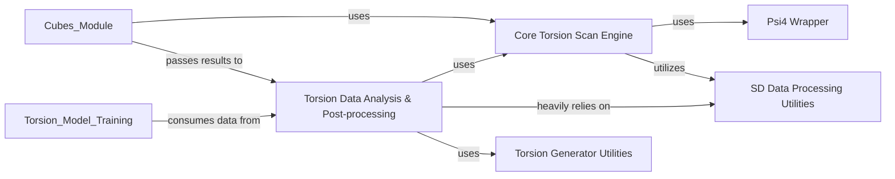

## Details

The `Core Torsion Algorithms` subsystem is central to the project's computational chemistry capabilities, focusing on the manipulation and analysis of molecular structures during torsion scans. It embodies the "Core Domain Logic" and leverages a "Data-Driven Architecture" to process and interpret computational results.

### Core Torsion Scan Engine

This component implements the fundamental algorithms for manipulating molecular structures during torsion scans. Its primary responsibilities include systematically rotating dihedral angles, normalizing molecular coordinates to a consistent frame, and orchestrating single-point energy calculations for each conformer at specific dihedral angles. It acts as the primary driver for initiating quantum chemistry calculations to generate torsion profiles.

**Related Classes/Methods**:

- <a href="https://github.com/pfizer-opensource/torsional-strain/blob/master/torsion/core/scan.py#L1-L1" target="_blank" rel="noopener noreferrer">`torsion.core.scan.py` (1:1)</a>

- <a href="https://github.com/pfizer-opensource/torsional-strain/blob/master/torsion/core/scan.py#L78-L186" target="_blank" rel="noopener noreferrer">`torsion.core.scan.calculate_energy` (78:186)</a>

- <a href="https://github.com/pfizer-opensource/torsional-strain/blob/master/torsion/core/scan.py#L32-L75" target="_blank" rel="noopener noreferrer">`torsion.core.scan.normalize_coordinates` (32:75)</a>

- <a href="https://github.com/pfizer-opensource/torsional-strain/blob/master/torsion/core/scan.py#L8-L29" target="_blank" rel="noopener noreferrer">`torsion.core.scan.get_dihedral` (8:29)</a>

### Torsion Data Analysis & Post-processing

This component is responsible for the post-processing and analysis of the raw energy data generated during torsion scans. It constructs comprehensive dihedral energy profiles, calculates torsional strain, and generates various molecular identifiers (such as modified InChI keys) for specific dihedrals. It aggregates results from the core scan engine and various utility modules to derive meaningful chemical insights.

**Related Classes/Methods**:

- <a href="https://github.com/pfizer-opensource/torsional-strain/blob/master/torsion/analysis/analysis.py#L1-L1" target="_blank" rel="noopener noreferrer">`torsion.analysis.analysis.py` (1:1)</a>

### Psi4 Wrapper

This component provides a dedicated abstraction layer for interacting with the external Psi4 quantum chemistry software. It handles the execution of Psi4 calculations, manages input/output data for Psi4, and converts Psi4 molecular outputs back into the project's internal data structures.

**Related Classes/Methods**:

- <a href="https://github.com/pfizer-opensource/torsional-strain/blob/master/torsion/psi4wrapper/psi4wrapper.py#L1-L1" target="_blank" rel="noopener noreferrer">`torsion.psi4wrapper.psi4wrapper.py` (1:1)</a>

### SD Data Processing Utilities

This utility module is dedicated to handling the reading, writing, and general manipulation of SD (Structure-Data) file data, a common format for chemical information. It provides functions to extract specific data from SD files, save computational results, and prepare data for energy profiles.

**Related Classes/Methods**:

- <a href="https://github.com/pfizer-opensource/torsional-strain/blob/master/torsion/utils/process_sd_data.py#L1-L1" target="_blank" rel="noopener noreferrer">`torsion.utils.process_sd_data.py` (1:1)</a>

- <a href="https://github.com/pfizer-opensource/torsional-strain/blob/master/torsion/utils/process_sd_data.py#L130-L148" target="_blank" rel="noopener noreferrer">`torsion.utils.process_sd_data.save_sddata` (130:148)</a>

- <a href="https://github.com/pfizer-opensource/torsional-strain/blob/master/torsion/utils/process_sd_data.py#L17-L25" target="_blank" rel="noopener noreferrer">`torsion.utils.process_sd_data.get_sd_data` (17:25)</a>

- <a href="https://github.com/pfizer-opensource/torsional-strain/blob/master/torsion/utils/process_sd_data.py#L121-L127" target="_blank" rel="noopener noreferrer">`torsion.utils.process_sd_data.write_energy_profile_to_sddata` (121:127)</a>

- <a href="https://github.com/pfizer-opensource/torsional-strain/blob/master/torsion/utils/process_sd_data.py#L260-L287" target="_blank" rel="noopener noreferrer">`torsion.utils.process_sd_data.generate_energy_profile_sd_data_1d` (260:287)</a>

### Torsion Generator Utilities

This utility module focuses on generating, identifying, and characterizing torsion-related molecular fragments and their properties. It provides functions for mapping atoms, generating modified InChI keys for specific dihedrals, and identifying relevant torsion fragments within a larger molecule.

**Related Classes/Methods**:

- <a href="https://github.com/pfizer-opensource/torsional-strain/blob/master/torsion/utils/torsion_generator.py#L1-L1" target="_blank" rel="noopener noreferrer">`torsion.utils.torsion_generator.py` (1:1)</a>

- <a href="https://github.com/pfizer-opensource/torsional-strain/blob/master/torsion/utils/torsion_generator.py#L1-L1" target="_blank" rel="noopener noreferrer">`torsion.utils.torsion_generator.get_torsion_oeatom_list` (1:1)</a>

- <a href="https://github.com/pfizer-opensource/torsional-strain/blob/master/torsion/utils/torsion_generator.py#L421-L451" target="_blank" rel="noopener noreferrer">`torsion.utils.torsion_generator.get_modified_inchi_key` (421:451)</a>

- <a href="https://github.com/pfizer-opensource/torsional-strain/blob/master/torsion/utils/torsion_generator.py#L364-L396" target="_blank" rel="noopener noreferrer">`torsion.utils.torsion_generator.get_molecule_torsion_fragments` (364:396)</a>

- <a href="https://github.com/pfizer-opensource/torsional-strain/blob/master/torsion/utils/torsion_generator.py#L403-L418" target="_blank" rel="noopener noreferrer">`torsion.utils.torsion_generator.get_fragment_to_parent_atom_mapping` (403:418)</a>

- <a href="https://github.com/pfizer-opensource/torsional-strain/blob/master/torsion/utils/torsion_generator.py#L1-L1" target="_blank" rel="noopener noreferrer">`torsion.utils.torsion_generator.get_modified_molecule_inchi` (1:1)</a>

### [FAQ](https://github.com/CodeBoarding/GeneratedOnBoardings/tree/main?tab=readme-ov-file#faq)