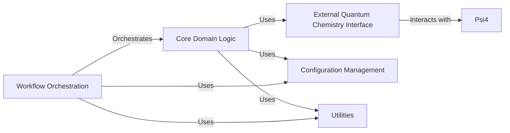

## Details

The `torsional-strain` project is structured around several key components designed to facilitate scientific workflows, particularly in quantum chemistry calculations. The `External Quantum Chemistry Interface` acts as a crucial abstraction layer for integrating with external quantum chemistry software like Psi4, handling data conversion, I/O formatting, execution management, and error handling, thereby promoting modularity and reusability. The `Core Domain Logic` encapsulates the primary scientific algorithms, including conformer generation, torsional scanning, and energy calculations. `Psi4` is an external, high-fidelity quantum chemistry software package that performs the actual quantum mechanical calculations, integrated via the `External Quantum Chemistry Interface`. `Workflow Orchestration` defines and manages the overall scientific workflows, especially within the OpenEye Orion platform. `Configuration Management` centralizes and manages all configurable parameters, ensuring flexibility. Finally, `Utilities` provides generic helper functions and common utilities used across the project. These components are fundamental due to their critical roles in integrating external tools, performing core scientific computations, managing workflows, and providing essential supporting infrastructure, aligning with patterns like Wrapper/Adapter, Data-Driven, Modular, and Workflow/Pipeline Architectures.

### External Quantum Chemistry Interface [[Expand]](./External_Quantum_Chemistry_Interface.md)

This component acts as an essential abstraction layer for integrating with external quantum chemistry software, primarily Psi4. Its core responsibilities include: Data Conversion (e.g., converting OpenEye molecules to Psi4 format), Input/Output Formatting (generating Psi4 input files and parsing output), Execution Management (invoking Psi4 processes), and Error Handling. This design effectively shields the core computational chemistry algorithms within `torsional-strain` from the intricate, tool-specific complexities of Psi4, promoting modularity and facilitating potential integration with other quantum chemistry packages in the future.

**Related Classes/Methods**:

- <a href="https://github.com/pfizer-opensource/torsional-strain/blob/master/torsion/psi4wrapper/psi4wrapper.py#L1-L100" target="_blank" rel="noopener noreferrer">`torsion.psi4wrapper.psi4wrapper` (1:100)</a>

### Core Domain Logic

Encapsulates the primary scientific algorithms, including conformer generation, torsional scanning, and energy calculations, forming the computational heart of the application.

**Related Classes/Methods**:

- `torsion.core.some_module` (1:100)

- `torsion.cubes.another_module` (1:100)

### Psi4

An external, high-fidelity quantum chemistry software package that performs the actual quantum mechanical calculations. It is integrated into the system via the `External Quantum Chemistry Interface`.

**Related Classes/Methods**: _None_

### Workflow Orchestration

Defines and manages the overall scientific workflows, orchestrating the execution of various computational steps, particularly within the OpenEye Orion platform. Each floe represents a distinct, deployable workflow.

**Related Classes/Methods**:

- `floes.some_floe` (1:100)

### Configuration Management

Centralizes and manages all configurable parameters for the application, including computational settings, file paths, and platform-specific configurations, ensuring flexibility and maintainability.

**Related Classes/Methods**:

- `torsion.conf.settings` (1:100)

### Utilities

Provides a collection of generic helper functions and common utilities that are not specific to any single domain concept but are widely used across the project (e.g., I/O operations, data transformations).

**Related Classes/Methods**:

- `torsion.utils.helpers` (1:100)

### [FAQ](https://github.com/CodeBoarding/GeneratedOnBoardings/tree/main?tab=readme-ov-file#faq)