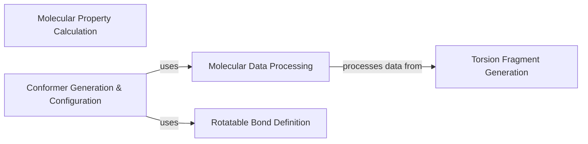

## Details

The `Molecular Data & Configuration Services` component is a critical part of the `torsional-strain` project, centralizing functionalities for handling molecular data, defining rotatable bonds, generating torsion fragments, and managing computational parameters. This component ensures data consistency and provides configurable settings essential for various simulation stages within the scientific workflow.

### Molecular Data Processing

This component is responsible for the low-level reading, writing, and manipulation of structured data (SD data) associated with molecular objects. It handles operations such as extracting energy profiles, retrieving torsion atom lists, and managing generic key-value pair data on molecules and their conformers. It ensures that molecular data is consistently stored and accessed throughout the workflow.

**Related Classes/Methods**:

- <a href="https://github.com/pfizer-opensource/torsional-strain/blob/master/torsion/utils/process_sd_data.py" target="_blank" rel="noopener noreferrer">`torsion.utils.process_sd_data`</a>

### Molecular Property Calculation

This component provides general utility functions for calculating fundamental molecular properties. Its responsibilities include determining bond lengths and identifying "undesirable" molecules based on criteria such as elemental composition or the absence of rotatable bonds. It also includes functionality for generating InChI keys, which are crucial for molecular identification and uniqueness.

**Related Classes/Methods**:

- <a href="https://github.com/pfizer-opensource/torsional-strain/blob/master/torsion/utils/molprop.py" target="_blank" rel="noopener noreferrer">`torsion.utils.molprop`</a>

### Torsion Fragment Generation

This component focuses on the extraction and preparation of specific molecular fragments centered around rotatable bonds. It identifies these bonds, extends the fragments to include relevant neighboring atoms and ring systems, and incorporates functional groups according to predefined rules. This process is vital for isolating and preparing the specific parts of a molecule that will undergo torsion scans.

**Related Classes/Methods**:

- <a href="https://github.com/pfizer-opensource/torsional-strain/blob/master/torsion/utils/torsion_generator.py" target="_blank" rel="noopener noreferrer">`torsion.utils.torsion_generator`</a>

### Rotatable Bond Definition

This component defines the criteria and rules for identifying various types of rotatable bonds within a molecule, such as amide, methyl, and ether linkages. It provides predicates that are used by other components to determine which bonds should be considered for torsion analysis. It also contains a predefined `torsion_library` that guides the conformer generation process.

**Related Classes/Methods**:

- <a href="https://github.com/pfizer-opensource/torsional-strain/blob/master/torsion/conf/rotors.py" target="_blank" rel="noopener noreferrer">`torsion.conf.rotors`</a>

### Conformer Generation & Configuration

This component is responsible for configuring and executing the generation of molecular conformers using external libraries like OpenEye Omega and Szybki. It manages computational parameters such as RMSD cutoffs, energy windows, and the maximum number of conformers. It applies specific rotor predicates to guide the conformer sampling and handles the generation of starting conformers for torsion scans, as well as the selection of optimal conformers.

**Related Classes/Methods**:

- <a href="https://github.com/pfizer-opensource/torsional-strain/blob/master/src/torsion/conf/conf.py" target="_blank" rel="noopener noreferrer">`torsion.conf.conf`</a>

### [FAQ](https://github.com/CodeBoarding/GeneratedOnBoardings/tree/main?tab=readme-ov-file#faq)