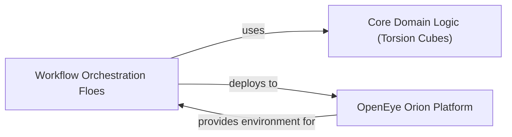

## Details

Analysis of the 'Workflow Orchestration & Floes' component, its sub-components, and their relationships within a scientific workflow application.

### Workflow Orchestration Floes [[Expand]](./Workflow_Orchestration_Floes.md)

These are the individual Python scripts (`floe_*.py`) that define and execute the end-to-end molecular simulation workflows on the OpenEye Orion platform. Each floe encapsulates a specific high-level pipeline logic, orchestrating a sequence of computational steps. They are responsible for managing input/output operations within the Orion environment and are designed to be self-contained and deployable.

**Related Classes/Methods**:

- <a href="https://github.com/pfizer-opensource/torsional-strain/blob/master/floes/floe_cyclic_dihedral_scan.py#L1-L1" target="_blank" rel="noopener noreferrer">`floes/floe_cyclic_dihedral_scan.py` (1:1)</a>

- <a href="https://github.com/pfizer-opensource/torsional-strain/blob/master/floes/floe_dihedral_scan.py#L1-L1" target="_blank" rel="noopener noreferrer">`floes/floe_dihedral_scan.py` (1:1)</a>

- <a href="https://github.com/pfizer-opensource/torsional-strain/blob/master/floes/floe_generate_conformers.py#L1-L1" target="_blank" rel="noopener noreferrer">`floes/floe_generate_conformers.py` (1:1)</a>

- <a href="https://github.com/pfizer-opensource/torsional-strain/blob/master/floes/floe_generate_fragments.py#L1-L1" target="_blank" rel="noopener noreferrer">`floes/floe_generate_fragments.py` (1:1)</a>

- <a href="https://github.com/pfizer-opensource/torsional-strain/blob/master/floes/floe_massively_parallel_dihedral_scan.py#L1-L1" target="_blank" rel="noopener noreferrer">`floes/floe_massively_parallel_dihedral_scan.py` (1:1)</a>

- <a href="https://github.com/pfizer-opensource/torsional-strain/blob/master/floes/floe_massively_parallel_multi_step_dihedral_scan.py#L1-L1" target="_blank" rel="noopener noreferrer">`floes/floe_massively_parallel_multi_step_dihedral_scan.py` (1:1)</a>

- <a href="https://github.com/pfizer-opensource/torsional-strain/blob/master/floes/floe_no_BrI_massively_parallel_dihedral_scan.py#L1-L1" target="_blank" rel="noopener noreferrer">`floes/floe_no_BrI_massively_parallel_dihedral_scan.py` (1:1)</a>

- <a href="https://github.com/pfizer-opensource/torsional-strain/blob/master/floes/floe_run_qm.py#L1-L1" target="_blank" rel="noopener noreferrer">`floes/floe_run_qm.py` (1:1)</a>

- <a href="https://github.com/pfizer-opensource/torsional-strain/blob/master/floes/floe_torsional_strain.py#L1-L1" target="_blank" rel="noopener noreferrer">`floes/floe_torsional_strain.py` (1:1)</a>

### Core Domain Logic (Torsion Cubes)

This component provides the fundamental computational chemistry functions used by the workflow floes. It includes operations such as conformer generation, energy calculations, systematic torsion drives, and the assembly of energy profiles. The floes call upon these functions to perform the actual scientific computations.

**Related Classes/Methods**:

- <a href="https://github.com/pfizer-opensource/torsional-strain/blob/master/torsion/cubes/generate_starting_conformers.py#L1-L1" target="_blank" rel="noopener noreferrer">`torsion.cubes.generate_starting_conformers` (1:1)</a>

- <a href="https://github.com/pfizer-opensource/torsional-strain/blob/master/src/torsion/cubes/generate_torsional_conformers.py#L1-L1" target="_blank" rel="noopener noreferrer">`torsion.cubes.generate_torsional_conformers` (1:1)</a>

- <a href="https://github.com/pfizer-opensource/torsional-strain/blob/master/torsion/cubes/calculate_energy.py#L1-L1" target="_blank" rel="noopener noreferrer">`torsion.cubes.calculate_energy` (1:1)</a>

- <a href="https://github.com/pfizer-opensource/torsional-strain/blob/master/torsion/cubes/drive_torsion.py#L1-L1" target="_blank" rel="noopener noreferrer">`torsion.cubes.drive_torsion` (1:1)</a>

- <a href="https://github.com/pfizer-opensource/torsional-strain/blob/master/torsion/cubes/calculate_profile.py#L1-L1" target="_blank" rel="noopener noreferrer">`torsion.cubes.calculate_profile` (1:1)</a>

- <a href="https://github.com/pfizer-opensource/torsional-strain/blob/master/torsion/cubes/generate_torsion_fragments.py#L1-L1" target="_blank" rel="noopener noreferrer">`torsion.cubes.generate_torsion_fragments` (1:1)</a>

### OpenEye Orion Platform

This is the cloud-based platform where the workflows are deployed and executed. It provides the computational environment, data management, and job scheduling capabilities necessary for running the molecular simulations at scale.

**Related Classes/Methods**: _None_

### [FAQ](https://github.com/CodeBoarding/GeneratedOnBoardings/tree/main?tab=readme-ov-file#faq)