```mermaid

graph LR

    Workflow_Orchestration_Floes["Workflow Orchestration & Floes"]

    Core_Torsion_Algorithms["Core Torsion Algorithms"]

    External_Quantum_Chemistry_Interface["External Quantum Chemistry Interface"]

    Molecular_Data_Configuration_Services["Molecular Data & Configuration Services"]

    Advanced_Molecular_Modeling["Advanced Molecular Modeling"]

    Reporting_Debugging_Utilities["Reporting & Debugging Utilities"]

    Workflow_Orchestration_Floes -- "Initiates/Orchestrates" --> Core_Torsion_Algorithms

    Workflow_Orchestration_Floes -- "Utilizes" --> External_Quantum_Chemistry_Interface

    Workflow_Orchestration_Floes -- "Accesses/Configures" --> Molecular_Data_Configuration_Services

    Core_Torsion_Algorithms -- "Delegates Calculations" --> External_Quantum_Chemistry_Interface

    Core_Torsion_Algorithms -- "Accesses/Stores" --> Molecular_Data_Configuration_Services

    Core_Torsion_Algorithms -- "Provides Results" --> Workflow_Orchestration_Floes

    External_Quantum_Chemistry_Interface -- "Provides Results" --> Core_Torsion_Algorithms

    Molecular_Data_Configuration_Services -- "Provides Data/Config" --> Workflow_Orchestration_Floes

    Molecular_Data_Configuration_Services -- "Provides Data/Definitions" --> Core_Torsion_Algorithms

    Molecular_Data_Configuration_Services -- "Provides Data" --> Advanced_Molecular_Modeling

    Molecular_Data_Configuration_Services -- "Provides Data" --> Reporting_Debugging_Utilities

    Advanced_Molecular_Modeling -- "Accesses Data" --> Molecular_Data_Configuration_Services

    Reporting_Debugging_Utilities -- "Accesses Data" --> Molecular_Data_Configuration_Services

    click Workflow_Orchestration_Floes href "https://github.com/pfizer-opensource/torsional-strain/blob/master/.codeboarding//Workflow_Orchestration_Floes.md" "Details"

    click Core_Torsion_Algorithms href "https://github.com/pfizer-opensource/torsional-strain/blob/master/.codeboarding//Core_Torsion_Algorithms.md" "Details"

    click External_Quantum_Chemistry_Interface href "https://github.com/pfizer-opensource/torsional-strain/blob/master/.codeboarding//External_Quantum_Chemistry_Interface.md" "Details"

    click Molecular_Data_Configuration_Services href "https://github.com/pfizer-opensource/torsional-strain/blob/master/.codeboarding//Molecular_Data_Configuration_Services.md" "Details"

    click Advanced_Molecular_Modeling href "https://github.com/pfizer-opensource/torsional-strain/blob/master/.codeboarding//Advanced_Molecular_Modeling.md" "Details"

```

## Details

The `torsional-strain` project, a scientific workflow application in computational chemistry, exhibits a clear modular and pipeline-driven architecture. The analysis reveals six core components that orchestrate, execute, and manage the complex molecular simulations.

### Workflow Orchestration & Floes [[Expand]](./Workflow_Orchestration_Floes.md)

This component is the central control unit, managing the end-to-end execution of molecular simulations on the OpenEye Orion platform. It orchestrates the sequence of computational steps, including conformer generation, energy calculations, systematic torsion drives, and the assembly of energy profiles, defining the high-level pipeline logic.

**Related Classes/Methods**:

- <a href="https://github.com/pfizer-opensource/torsional-strain/blob/master/torsion/cubes/generate_starting_conformers.py#L1-L1" target="_blank" rel="noopener noreferrer">`torsion.cubes.generate_starting_conformers` (1:1)</a>

- <a href="https://github.com/pfizer-opensource/torsional-strain/blob/master/src/torsion/cubes/generate_torsional_conformers.py#L1-L1" target="_blank" rel="noopener noreferrer">`torsion.cubes.generate_torsional_conformers` (1:1)</a>

- <a href="https://github.com/pfizer-opensource/torsional-strain/blob/master/torsion/cubes/calculate_energy.py#L1-L1" target="_blank" rel="noopener noreferrer">`torsion.cubes.calculate_energy` (1:1)</a>

- <a href="https://github.com/pfizer-opensource/torsional-strain/blob/master/torsion/cubes/drive_torsion.py#L1-L1" target="_blank" rel="noopener noreferrer">`torsion.cubes.drive_torsion` (1:1)</a>

- <a href="https://github.com/pfizer-opensource/torsional-strain/blob/master/torsion/cubes/calculate_profile.py#L1-L1" target="_blank" rel="noopener noreferrer">`torsion.cubes.calculate_profile` (1:1)</a>

- <a href="https://github.com/pfizer-opensource/torsional-strain/blob/master/torsion/cubes/generate_torsion_fragments.py#L1-L1" target="_blank" rel="noopener noreferrer">`torsion.cubes.generate_torsion_fragments` (1:1)</a>

### Core Torsion Algorithms [[Expand]](./Core_Torsion_Algorithms.md)

This component implements the fundamental computational chemistry algorithms. It handles the manipulation of molecular structures during torsion scans (e.g., systematic dihedral angle rotations, coordinate normalization) and performs post-processing to analyze energy profiles and calculate torsional strain.

**Related Classes/Methods**:

- <a href="https://github.com/pfizer-opensource/torsional-strain/blob/master/torsion/core/scan.py#L1-L1" target="_blank" rel="noopener noreferrer">`torsion.core.scan` (1:1)</a>

- <a href="https://github.com/pfizer-opensource/torsional-strain/blob/master/torsion/analysis/analysis.py#L1-L1" target="_blank" rel="noopener noreferrer">`torsion.analysis.analysis` (1:1)</a>

### External Quantum Chemistry Interface [[Expand]](./External_Quantum_Chemistry_Interface.md)

This component acts as an abstraction layer for integrating with external quantum chemistry software (e.g., Psi4). It is responsible for handling data conversion, input/output formatting, and executing quantum mechanical energy calculations, thereby shielding the core algorithms from tool-specific complexities.

**Related Classes/Methods**:

- <a href="https://github.com/pfizer-opensource/torsional-strain/blob/master/torsion/psi4wrapper/psi4wrapper.py#L1-L1" target="_blank" rel="noopener noreferrer">`torsion.psi4wrapper.psi4wrapper` (1:1)</a>

### Molecular Data & Configuration Services [[Expand]](./Molecular_Data_Configuration_Services.md)

This component centralizes services for managing molecular data (reading, writing, and manipulating SD files), defining rotatable bonds, generating torsion fragments, and handling global computational parameters. It ensures data consistency and provides configurable settings for various simulation stages.

**Related Classes/Methods**:

- <a href="https://github.com/pfizer-opensource/torsional-strain/blob/master/torsion/utils/process_sd_data.py#L1-L1" target="_blank" rel="noopener noreferrer">`torsion.utils.process_sd_data` (1:1)</a>

- <a href="https://github.com/pfizer-opensource/torsional-strain/blob/master/torsion/utils/molprop.py#L1-L1" target="_blank" rel="noopener noreferrer">`torsion.utils.molprop` (1:1)</a>

- <a href="https://github.com/pfizer-opensource/torsional-strain/blob/master/src/torsion/conf/conf.py#L1-L1" target="_blank" rel="noopener noreferrer">`torsion.conf.conf` (1:1)</a>

- <a href="https://github.com/pfizer-opensource/torsional-strain/blob/master/torsion/conf/rotors.py#L1-L1" target="_blank" rel="noopener noreferrer">`torsion.conf.rotors` (1:1)</a>

- <a href="https://github.com/pfizer-opensource/torsional-strain/blob/master/torsion/utils/torsion_generator.py#L1-L1" target="_blank" rel="noopener noreferrer">`torsion.utils.torsion_generator` (1:1)</a>

### Advanced Molecular Modeling [[Expand]](./Advanced_Molecular_Modeling.md)

This component focuses on advanced molecular representation and machine learning aspects. It provides functionalities for generating molecular symmetry functions, which are used as inputs for machine learning models, and potentially includes capabilities for model training.

**Related Classes/Methods**:

- <a href="https://github.com/pfizer-opensource/torsional-strain/blob/master/torsion/model/symmetry_function.py#L1-L1" target="_blank" rel="noopener noreferrer">`torsion.model.symmetry_function` (1:1)</a>

- <a href="https://github.com/pfizer-opensource/torsional-strain/blob/master/torsion/model/train.py#L1-L1" target="_blank" rel="noopener noreferrer">`torsion.model.train` (1:1)</a>

### Reporting & Debugging Utilities

This component offers utility functions primarily for inspecting and printing torsion-related data within the workflow. It aids in debugging, monitoring, and generating intermediate reports for analysis.

**Related Classes/Methods**:

- <a href="https://github.com/pfizer-opensource/torsional-strain/blob/master/torsion/cubes/process_sd_data.py#L4-L16" target="_blank" rel="noopener noreferrer">`torsion.cubes.process_sd_data.PrintTorsion` (4:16)</a>

### [FAQ](https://github.com/CodeBoarding/GeneratedOnBoardings/tree/main?tab=readme-ov-file#faq)